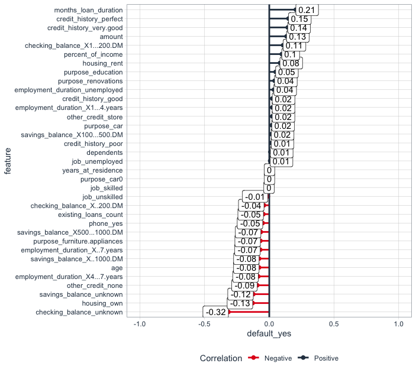
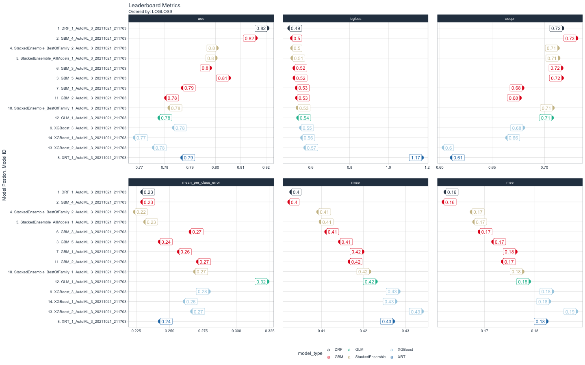

# Credit-Risk-Analysis-
The purpose of the project was to develop the model to predict the loan default probability issued by 
the bank to the borrowewrs. 
The dataset on credit defaults was taken from the book: Machine Learning with R: Expert techniques for predictive modeling, 3rd Edition, 
The correlatio analysis and Modelling Amalysis is based on the coding practices learned 
 from Business Science University R-Track. 

## Part 1. Correlation analysis: 
In The first part of the analysis the data discovery as a well as the correlation between predictors and the target was 
performed to determine whether the given features could be usefull in predicting the probability 
of the default of the bank customers. 
As a result the feautures that have both considerable positive and negative correlation with defautlt metric 
were detected: 

## Part2. Modelling the loan default probability 
In the second part of the analysis the best models were selected to that has the best predicting 
power to detect the potenially defaulting loans. The h2o Automatic Machine learning was applied to 
pick the winning model. The leaderdashboard is presented below to disply the perfomance metrcis of 
of the models used: 

